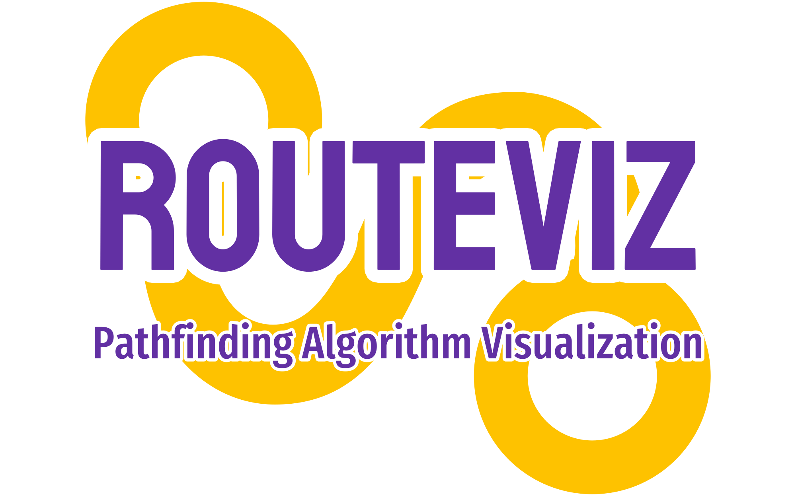

</img>

RouteViz is a repository that provides visualizations of various pathfinding algorithms implemented in both C++ with SFML and JavaScript. This project aims to help users understand and compare the performance of different pathfinding algorithms.

## Features

- **Interactive Visualizations**: RouteViz offers interactive visual representations of pathfinding algorithms, allowing users to see how the algorithms navigate through different scenarios.

- **Multiple Algorithms**: The repository includes implementations of popular pathfinding algorithms like Dijkstra's Algorithm, A* Algorithm and Breadth-First Search (BFS).

- **C++ with SFML**: The C++ version of RouteViz uses SFML for graphics rendering, providing a smooth and visually appealing experience.

- **JavaScript Version**: For web-based visualization, the JavaScript version of RouteViz utilizes HTML, CSS, and JavaScript to create an interactive interface accessible through a web browser.

## Getting Started

### C++ Version

1. Clone the repository: `git clone https://github.com/NebulaTris/routeviz.git`
2. Navigate to the `cpp-sfml` directory.
3. Build and run the C++ program using your preferred compiler.

### JavaScript Version

1. Clone the repository: `git clone https://github.com/NebulaTris/routeviz.git`
2. Navigate to the `js` directory.
3. Open the `index.html` file in a web browser.

## Usage

- Select an algorithm from the interface to visualize how it finds the optimal path.
- Customize the start and end points, as well as any obstacles, to test algorithm behavior in different scenarios.

## Contributing

We welcome contributions to enhance the functionality and features of RouteViz. Please fork the repository and submit a pull request with your proposed changes.

## License

This project is licensed under the MIT License - see the [LICENSE](LICENSE) file for details.

---
